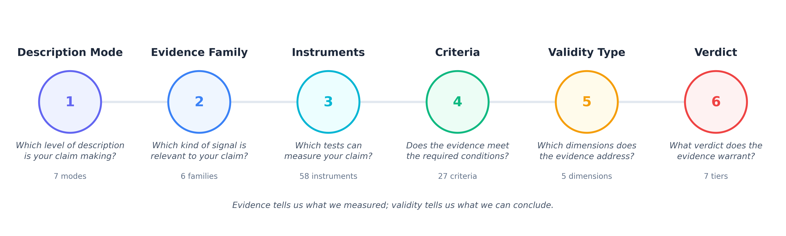

# Mechanistic Validity

> **Under active development.**

Mechanistic Validity is a framework aimed at extending mechanistic interpretability, using validation methodology from philosophy of science, neuroscience, pharmacology and measurement theory. 

This repository does not include any new experiment results, novel methods, or evaluations, as the contribution is purely theoretical. any scripts included are intended to be viewed as examples only.

The goal of this project is to document the current gaps in MI, and provide an outline for how these gaps can potentially be addressed in the future. 

My main inspiration from this has been https://learnmechinterp.com/, which I believe is the best resource for people new to the field. This framework sits on top, providing a way to validate the claims made, rather than document and categorize every individual paper and contribution to the field.  

Below is a high level overview of three key concepts in the framework:

  

## Mechanistic Validity Framework

### Five validity lenses

| Lens | Tradition | Core question |
|---|---|---|
| Construct | Philosophy of science | Is the claim falsifiable and well-defined? |
| Internal | Neuroscience | Is the causal evidence sound? |
| External | Pharmacology | Does it generalize beyond the test conditions? |
| Measurement | Measurement theory | Are the instruments reliable and calibrated? |
| Interpretive | MI | Is the description level declared and consistent? |

### Six evidence families

| Family | What it asks |
|---|---|
| Causal | Does X causally produce Y? |
| Structural | Do the weights encode the claimed computation? |
| Information-theoretic | What information flows where? |
| Behavioral | Does the circuit reproduce model behavior? |
| Representational | What geometric structure do activations have? |
| Measurement-theoretic | Are the instruments themselves reliable? |

### Verdict tiers

| Tier | Name | What it means |
|---|---|---|
| 1 | Proposed | Structural alignment only, no causal evidence |
| 2 | Causally suggestive | Necessity established (ablation degrades behavior) |
| 3 | Mechanistically supported | Necessity + sufficiency |
| 4 | Triangulated | Multiple independent instruments converge |
| 5 | Validated | All five lenses pass |

## 13 worked case studies

The full framework applied to published MI results:

| Case study | Verdict |
|---|---|
| [IOI Circuit (Wang et al. 2022)](https://arxiv.org/abs/2211.00593) | Triangulated |
| [Induction Heads (Olsson et al. 2022)](https://arxiv.org/abs/2209.11895) | Mechanistically supported |
| [Greater-Than (Hanna et al. 2023)](https://arxiv.org/abs/2305.00586) | Mechanistically supported |
| [Grokking (Nanda et al. 2023)](https://arxiv.org/abs/2301.05217) | Causally suggestive |
| [Copy Suppression (McDougall et al. 2023)](https://arxiv.org/abs/2310.04625) | Mechanistically supported |
| [Successor Heads (Gould et al. 2023)](https://arxiv.org/abs/2312.09230) | Causally suggestive |
| [Docstring Circuit (Heimersheim & Janiak 2023)](https://arxiv.org/abs/2307.14486) | Causally suggestive |
| [Knowledge Neurons (Dai et al. 2022)](https://arxiv.org/abs/2104.04264) | Proposed |
| [Othello World Model (Li et al. 2023)](https://arxiv.org/abs/2210.13382) | Triangulated |
| [SAE Features (Cunningham et al. 2023)](https://arxiv.org/abs/2309.08600) | Causally suggestive |
| [Superposition (Elhage et al. 2022)](https://transformer-circuits.pub/2022/toy_model/index.html) | Proposed |
| [Probing Classifiers (Belinkov 2022)](https://arxiv.org/abs/2102.12452) | Proposed |
| [Gender Bias Circuits (Vig et al. 2020)](https://arxiv.org/abs/2010.02573) | Proposed |

## Citation

If you use this framework in your research, see [`CITATION.cff`](CITATION.cff) or click the "Cite this repository" button on GitHub.

## License

[MIT](LICENSE)
