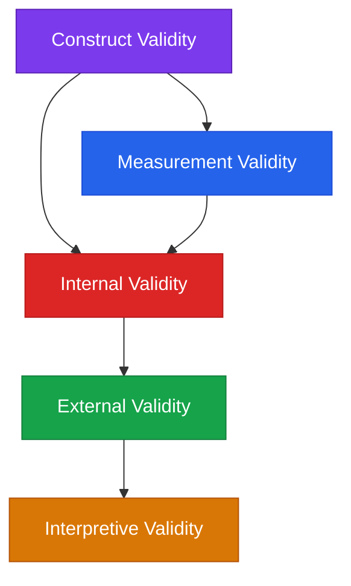

# Dependency Order

The five validity types are not a checklist to be completed in any order. They have a dependency structure: some types cannot be satisfied without prior work on others.

## The dependency graph

The arrows mean: the downstream type *presupposes* that the upstream type has been addressed. A gap upstream produces a hole in the downstream verdict even when the downstream evidence looks complete.

## Construct gates everything

A circuit claim begins with a construct: the thing being claimed. If the construct is not defined independently of the components found by the discovery procedure, nothing downstream is interpretable.

The failure mode is **construct conflation**: the circuit is named for a behavior, and the name is then treated as if it described a coherent computational concept. Until the construct is defined clearly enough to be falsified — until there is a stated numerical threshold that would count as disconfirmation — the claim has no determinate content.

**Practical consequence:** The construct definition should be written before instruments are chosen.

## Measurement gates internal

Every number that internal validity rests on is produced by an instrument. If the instrument is unreliable, poorly calibrated, or lacking construct coverage, then the internal validity evidence is contaminated at the source.

The most common version of this failure: an IIA score of 0.48 is reported as evidence for a causal relationship, but the random-vector baseline is 0.44. The internal validity claim is built on a measurement that has not established baseline separation.

**Practical consequence:** Baseline separation, reliability, and sensitivity should be established before interpreting internal validity evidence.

## Internal gates external

External validity asks whether the claim generalizes. But "generalizes" is only meaningful relative to a well-established local result. If the internal validity case has not been made, a positive cross-architecture result is noise, not generalization.

**Practical consequence:** The external validity campaign (cross-task, cross-scale, cross-architecture) should begin after the internal validity case has reached at least *Mechanistically supported* tier.

## Interpretive validity is applied last — to the verdict, not the evidence

Interpretive validity audits the *verdict itself* rather than the evidence beneath it. The question is whether the description-mode tag in the verdict matches what the evidence actually licenses. A finding can satisfy internal, external, and measurement validity and still fail interpretive validity if the verdict claims an algorithmic characterization that the evidence only supports at the implementational level.

**Practical consequence:** Write the verdict first at the lowest licensed mode tag. Upgrade only when the evidence explicitly licenses it.

## Summary

| Type | Presupposes | Gated by |
|---|---|---|
| Construct | Nothing | — |
| Measurement | A defined construct | Construct |
| Internal | A calibrated instrument | Measurement |
| External | An established local result | Internal |
| Interpretive | A fully assembled verdict | All four above |

## Common dependency violations in MI papers

| Pattern | What it looks like | Violation |
|---|---|---|
| Circular construct | Circuit named for what instruments found | Construct: no independent definition |
| Uncalibrated IIA | IIA 0.48 without random-vector baseline | Measurement gates internal |
| Single-seed generalization | Reported as robust from one seed | Measurement (reliability) gates internal |
| Cross-arch before local | Cross-model result before within-model necessity | Internal gates external |
| Algorithmic tag from ablation | "implements SVA" from ablation alone | Interpretive: tag not licensed |
