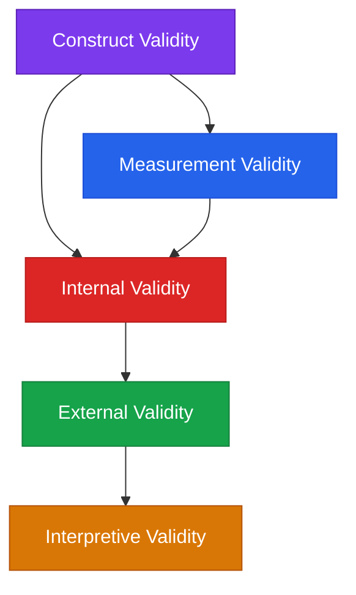
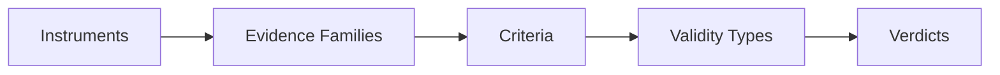

import { Card, CardGrid, Badge, Tabs, TabItem, LinkCard } from '@astrojs/starlight/components';

# Style Examples

Everything available for formatting pages in this site.

---

## Badges

Inline status indicators:

<Badge text="Validated" variant="success" />
<Badge text="Proposed" variant="note" />
<Badge text="Disconfirmed" variant="danger" />
<Badge text="Triangulated" variant="tip" />
<Badge text="Underdetermined" variant="caution" />
<Badge text="Default" variant="default" />

Badges also work in sidebar navigation via frontmatter (see the Verdicts section).

---

## Cards

<CardGrid>
  <Card title="Causal Instruments" icon="warning">
    Pearl SCM, Rubin CATE, Woodward interventionism, mediation analysis, and more.
  </Card>
  <Card title="Structural Instruments" icon="puzzle">
    SVD spectral analysis, OV/QK decomposition, weight alignment, effective rank.
  </Card>
  <Card title="Information Instruments" icon="random">
    Transfer entropy, PID, mutual information, NOTEARS discovery.
  </Card>
  <Card title="Behavioral Instruments" icon="rocket">
    Logit diff recovery, KL divergence, generalization gap, MDL compression.
  </Card>
</CardGrid>

---

## Link Cards

<LinkCard
  title="Read the Framework"
  description="Start with the taxonomy overview to understand the six layers."
  href="/framework/taxonomy/"
/>

<LinkCard
  title="Quickstart Guide"
  description="Audit your first circuit claim in 10 minutes."
  href="/start/quickstart/"
/>

---

## Tabs

<Tabs>
  <TabItem label="Activation Patching">
    Replace activations at a specific position with those from a counterfactual input. Measures necessity of the component for the behavior.
  </TabItem>
  <TabItem label="Causal Scrubbing">
    Recursively verify that each node in a computational graph contributes only the information attributed to it by the hypothesis.
  </TabItem>
  <TabItem label="IIA">
    Interchange Intervention Accuracy — swap a single representation between inputs and measure whether behavior follows the swapped variable.
  </TabItem>
</Tabs>

---

## Admonitions

:::note
This is a note — useful for supplementary context that doesn't interrupt the main flow.
:::

:::tip
This is a tip — practical advice or best practices.
:::

:::caution
This is a caution — something that could go wrong if you're not careful.
:::

:::danger
This is a danger — a known failure mode or critical error to avoid.
:::

---

## Mermaid Diagrams





---

## Code Blocks (Expressive Code)

Basic syntax highlighting:

```python
def compute_iia(model, clean_input, patch_input, target_idx):
    """Interchange intervention accuracy."""
    clean_acts = model.run_with_cache(clean_input)
    patch_acts = model.run_with_cache(patch_input)
    
    patched_logits = model.run_with_hooks(
        clean_input,
        fwd_hooks=[(hook_point, lambda act, hook: patch_acts[hook.name])]
    )
    return (patched_logits.argmax(-1) == target_idx).float().mean()
```

With line highlighting and title:

```python title="lib/analysis/stages/stage_10_factor_decode.py" {3-5}
def bidirectional_logit_lens(factor_bank, tokenizer):
    W_U = model.W_U  # (d_model, d_vocab)
    factor_logits = factor_bank.factors @ W_U
    top_tokens = factor_logits.topk(10, dim=-1)
    bottom_tokens = factor_logits.topk(10, dim=-1, largest=False)
    return top_tokens, bottom_tokens
```

Diff format:

```python del={2} ins={3}
# Before: uncalibrated
score = compute_iia(model, clean, patch, target)
score = compute_iia(model, clean, patch, target) - baseline_iia
```

---

## Tables

| Verdict | Tier | Requirements |
|---|:---:|---|
| Proposed | A | Construct defined, one instrument chosen |
| Causally suggestive | B | One causal instrument with baseline separation |
| Mechanistically supported | C | Necessity + sufficiency + measurement calibration |
| Triangulated | D | Three evidence families converge |
| Validated | E | All five validity types pass threshold |

---

## Footnotes

The framework draws on Bradford Hill's criteria for causal inference[^1], adapted for the computational setting where controlled intervention is possible[^2].

[^1]: Hill, A.B. (1965). The environment and disease: association or causation?
[^2]: Unlike epidemiology, we can perform true interventions rather than relying on observational associations.

---

## Asides / Custom markup

> **Key insight:** A circuit claim is not a binary — it's a pattern across five dimensions. The framework makes the pattern visible.

---

## Math (if needed)

Math rendering requires `remark-math` + `rehype-katex` plugins. Once installed, inline math uses single dollar signs and display math uses double:

```markdown
Inline: $IIA = E[1(f(x) = y)]$

Display:
$$
\text{IIA} = \mathbb{E}[\mathbf{1}(f(x_{\text{patched}}) = y_{\text{target}})]
$$
```

---

## Images

Images can be placed in `src/assets/` and referenced with standard markdown:

```markdown

```

---

## What else could we add?

Potential additional plugins/features to explore:

- **starlight-links-validator** — checks for broken internal links at build time
- **starlight-typedoc** — auto-generates API docs from TypeScript
- **Custom sidebar icons** — per-section icons in the nav
- **View transitions** — smooth page-to-page animations (Astro built-in)
- **Obsidian-style wikilinks** — `[[page-name]]` syntax that resolves to proper links
- **Graph view** — D3-based visualization of page connections (heavier lift)
- **PDF export** — compile sections into a printable document
- **Version selector** — if the framework evolves, show v1/v2 side by side
